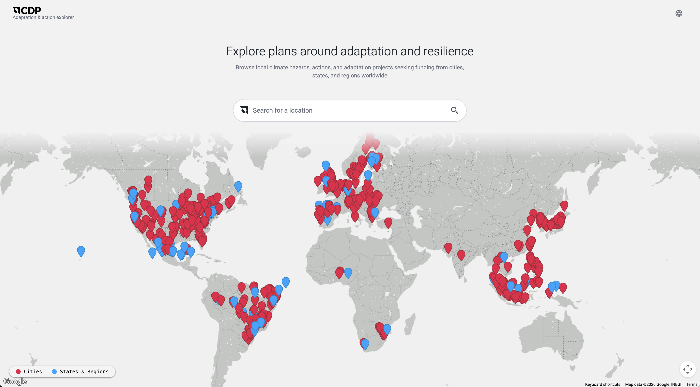

# CDP Adaptation & Action Explorer

A unified platform to synthesize fragmented environmental hazard data and siloed resilience best practices, helping cities, states, regions, and their partners drive Earth-positive action.

Deployment URLs are managed in Google Cloud Run. The VitePress docs are served from [https://cdp-action-explorer.net/docs/](https://cdp-action-explorer.net/docs/). See [docs/deployment.md](docs/deployment.md) for the current deployment topology.

## 📱 Preview


*Explore local climate hazards and adaptation projects worldwide.*

## 🚀 Getting Started

Please see **[SETUP.md](SETUP.md)** for detailed installation instructions.

## 🏗 Architecture & Core Concepts

### Overall App Structure

```
cdp-adapt-ex/
├── backend/           # FastAPI (Python 3.13)
│   ├── app/
│   │   ├── api/v1/    # Endpoint definitions & Pydantic schemas
│   │   ├── services/  # Business logic and external service clients
│   │   │   └── clients/database/ # Data Access Layer (Repositories)
│   │   ├── models/    # SQLModel database models
│   │   ├── shared/    # Config, security, logging
│   │   └── main.py    # FastAPI entry point
│   ├── pyproject.toml # Package management via `uv`
│   └── tests/         # Pytest suite
├── ai-server/         # Standalone OpenAI-compatible Ask the AI Explorer service
├── client/            # Auto-generated TypeScript API client
│   ├── scripts/       # Generation & patching scripts
│   └── src/           # Generated models and services
├── frontend/          # Angular 20 & Tailwind CSS
│   ├── src/app/
│   │   ├── core/      # Singleton services, guards, interceptors
│   │   ├── features/  # Domain features (Map, Chat, Hazard, etc.)
│   │   └── shared/    # Reusable components & UI building blocks
│   └── tailwind.config.js
├── data/              # Seed data, migration sources, and climate layer scripts
├── scripts/           # Cities, States and Regions BQ data pipeline (notebooks, BQ-side SQL helpers, validation)
├── tools/             # Repo-level developer utilities (docs build, frontend data sync)
├── docs/              # Canonical handoff and technical documentation
└── Makefile           # Project automation (install, test, lint)
```

The Cities, States and Regions 2025 data pipeline (notebook -> BQ -> Cloud SQL) is documented in [`docs/data_pipeline.md`](docs/data_pipeline.md), which covers the four pipeline stages and the CloudSQL migration.

### Infrastructure & Cloud Architecture

The platform is built on Google Cloud Platform (GCP).

- **Compute (Cloud Run)**: The Angular frontend, FastAPI backend, and standalone AI server are containerized and hosted on Cloud Run.
- **Database (Cloud SQL)**: PostgreSQL stores Cities, States and Regions analytical tables plus app-owned onboarding telemetry.
- **AI & LLM**: Ask the AI Explorer is served by the standalone `ai-server`, which exposes OpenAI-compatible chat and follow-up endpoints backed by Gemini.
- **Geospatial**: Google Maps powers the UI map, while Google Earth Engine provides hazard layer tiles through the backend.

## 🚀 Deployment

For detailed information on automatic CI/CD pipelines and manual deployment steps, please refer to the **[Deployment Documentation](docs/deployment.md)**.

## 📚 Documentation Index

| Topic | Description |
|-------|-------------|
| 🛠 **[SETUP.md](SETUP.md)** | Step-by-step local development environment setup. |
| 🤝 **[CONTRIBUTING.md](CONTRIBUTING.md)** | Guidelines for reporting bugs, suggesting features, and PR workflows. |
| 📚 **[Docs Index](docs/README.md)** | Canonical documentation map for backend, AI server, data, deployment, and translation. |
| 🚀 **[Deployment Guide](docs/deployment.md)** | CI/CD pipelines, Cloud Run configuration, and manual deployment. |
| 🧪 **[Testing](SETUP.md#-testing)** | Overview of testing strategies, or module-specific details in [Backend Tests](backend/tests/README.md) and [Frontend Tests](frontend/README.md#-testing). |
| ⚙️ **[Backend Docs](docs/backend/README.md)** | FastAPI architecture, services, and database repository pattern. |
| 🤖 **[AI Server Docs](docs/ai-server/README.md)** | Ask the AI Explorer routes, prompt workflow, and testing notes. |
| 📊 **[Data & DB Docs](docs/data.md)** | Database schema, seed data, and data management details. |
| 🔄 **[Data Pipeline](docs/data_pipeline.md)** | End-to-end runbook for full application data updates (BQ notebooks → Cloud SQL migration). |
| 🎨 **[Frontend Docs](frontend/README.md)** | Angular 20 structure, Tailwind CSS usage, and component patterns. |
| 🔒 **[SECURITY.md](SECURITY.md)** | Vulnerability reporting and security policies. |
| 📄 **[LICENSE](LICENSE)** | Project licensing information. |
