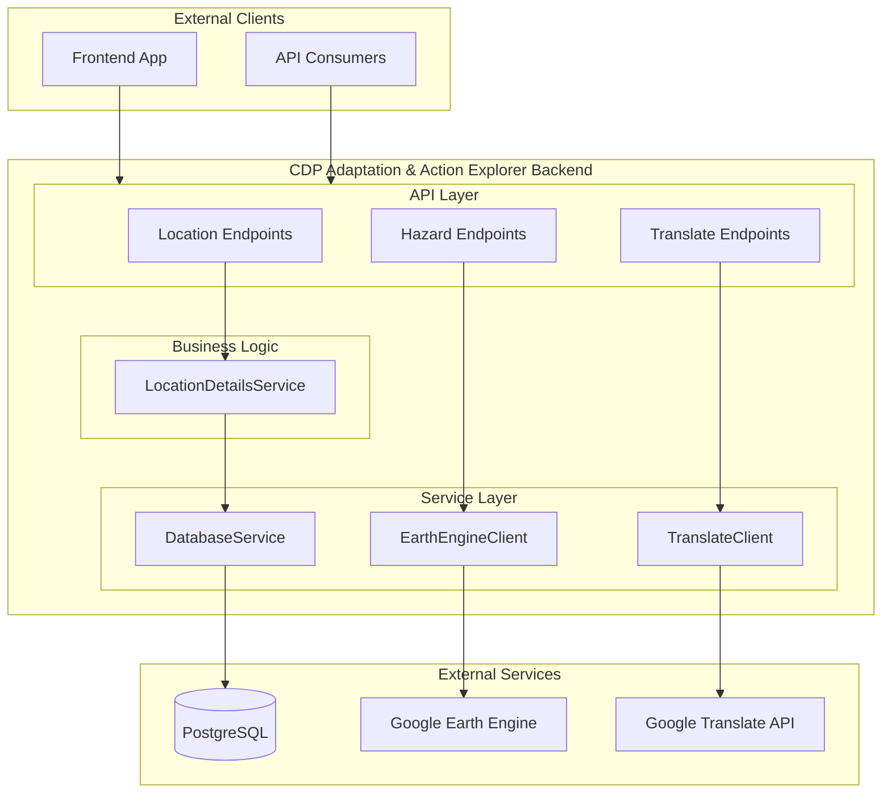

# CDP Adaptation & Action Explorer - Backend

A FastAPI-based backend providing location, hazard, and translation APIs for the CDP Adaptation & Action Explorer platform.

## Tech Stack

- **Framework:** [FastAPI](https://fastapi.tiangolo.com/)
- **Database:** [SQLModel](https://sqlmodel.tiangolo.com/) (SQLAlchemy + Pydantic) with PostgreSQL
- **Geospatial:** Google Earth Engine (Hazard data)
- **Package Management:** [uv](https://github.com/astral-sh/uv)

AI functionality is now owned by the separate `ai-server` service.

## Architecture Overview



## Project Structure

```text
backend/
├── app/
│   ├── api/v1/         # API routes (hazards, locations, translate)
│   ├── models/         # SQLModel database entities
│   ├── schemas/        # Pydantic API schemas
│   ├── services/       # Service clients and implementations
│   │   ├── clients/    # External API clients (Earth Engine, Translate)
│   │   ├── impls/      # Service implementations
│   │   └── interfaces/ # Service contracts (Protocols)
│   ├── shared/         # Configuration, logging, and common utilities
│   └── utils/          # Utilities
├── docs/               # Technical documentation
├── scripts/            # Utility and maintenance scripts
└── tests/              # Pytest suite
```

## Getting Started

For detailed installation and local development instructions, please refer to the **[root SETUP.md](../SETUP.md)**.

### Quick Start (Backend)

1. **Environment Setup**:
   ```bash
   cp .env-example .env
   ```
2. **Install Dependencies**:
   ```bash
   uv sync
   ```
3. **Run Server**:
   ```bash
   uv run fastapi dev app/main.py
   ```

The API will be available at `http://localhost:8000`.
Swagger documentation is at `http://localhost:8000/docs`.

### Testing

```bash
make test-backend
```

## Documentation

Detailed technical guides are available in the [docs/](./docs/) directory:

- [Database Layer](./docs/database.md): SQLModel entities, repositories, and connection pooling.
- [LLM Integration](./docs/llm-integration.md): Gemini API, follow-up suggestions, and chat completions.
- [Hazard Data Service](./docs/hazard-service.md): Earth Engine integration for geospatial layers.
