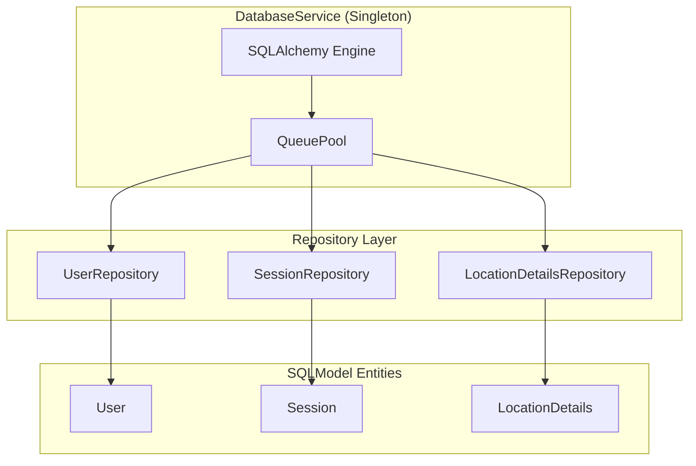
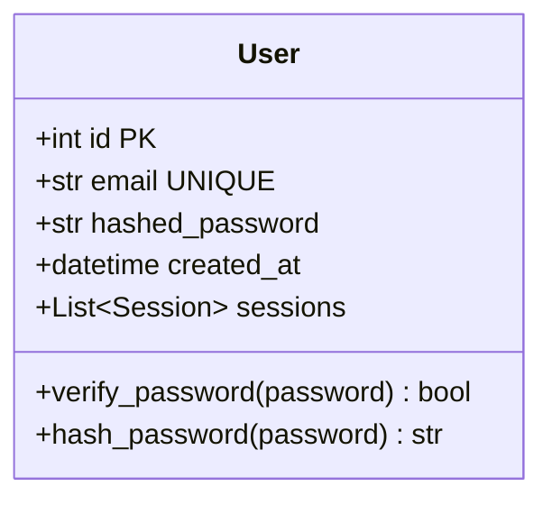
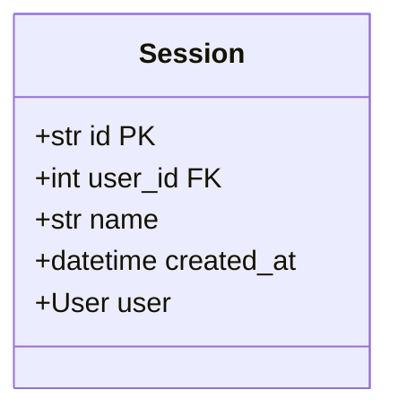
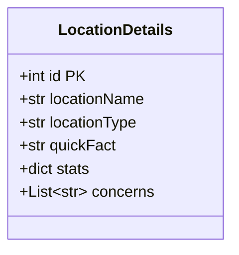
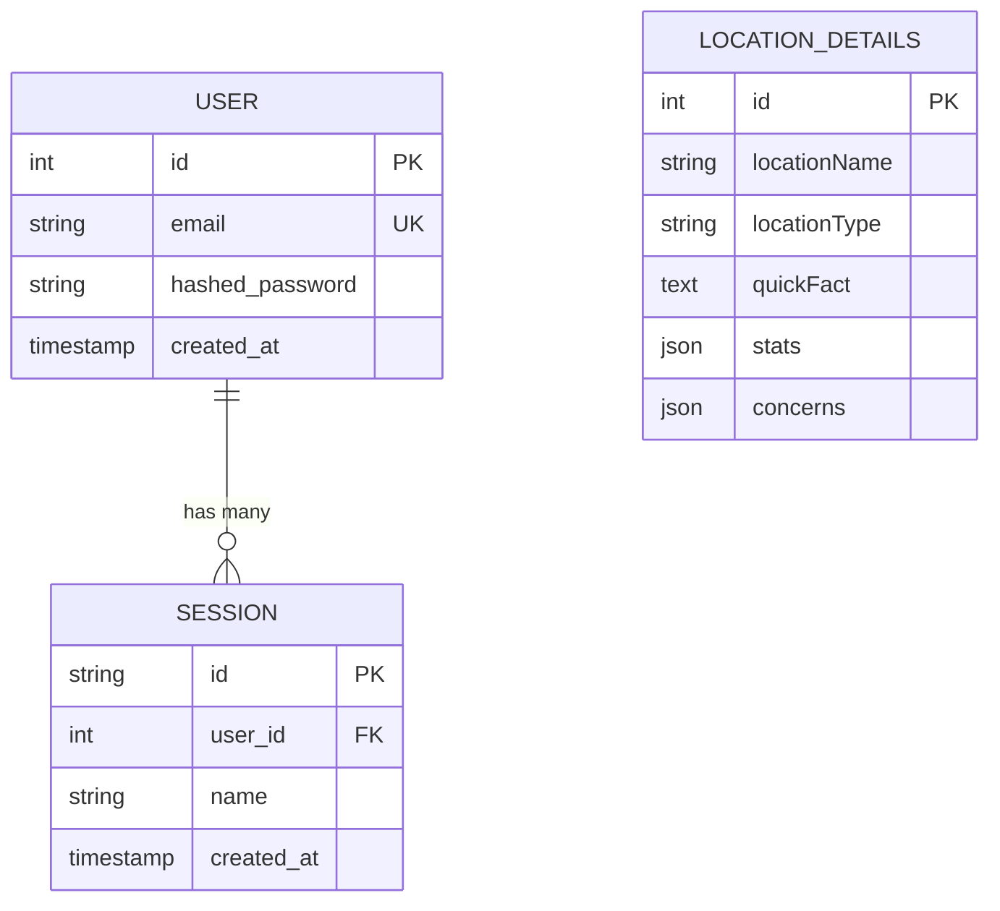

# Database Layer

The database layer uses SQLModel (SQLAlchemy + Pydantic) with a repository pattern for clean separation of concerns.

## Architecture



## DatabaseService

**Source:** `app/services/clients/database/base.py:41-172`

The `DatabaseService` is a singleton that manages the database connection pool and provides access to repositories.

### Initialization

```python
# app/services/clients/database/base.py:61-111
def _initialize_engine(self):
```

**Connection Pool Configuration:**
| Parameter | Value | Description |
|-----------|-------|-------------|
| `pool_pre_ping` | `True` | Test connections before use |
| `poolclass` | `QueuePool` | Thread-safe connection pooling |
| `pool_size` | 20 (default) | Base pool size |
| `max_overflow` | 10 (default) | Additional connections allowed |
| `pool_timeout` | 30s | Connection acquisition timeout |
| `pool_recycle` | 1800s | Recycle connections after 30 minutes |

### Repository Access

```python
# Access via properties
database_service.users        # UserRepository
database_service.sessions     # SessionRepository
database_service.location_details  # LocationDetailsRepository
```

### Health Check

**Source:** `app/services/clients/database/base.py:155-168`

```python
async def health_check(self) -> bool:
    with Session(self.engine) as session:
        session.exec(select(1)).first()
        return True
```

## Entity Models

### User Model

**Source:** `app/models/user.py:20-47`



**Table:** `user`

| Column | Type | Constraints |
|--------|------|-------------|
| `id` | `INTEGER` | Primary Key, Auto-increment |
| `email` | `VARCHAR` | Unique, Indexed |
| `hashed_password` | `VARCHAR` | Not Null |
| `created_at` | `TIMESTAMP` | Default: UTC now |

### Session Model

**Source:** `app/models/session.py:18-33`



**Table:** `session`

| Column | Type | Constraints |
|--------|------|-------------|
| `id` | `VARCHAR` | Primary Key (UUID) |
| `user_id` | `INTEGER` | Foreign Key → `user.id` |
| `name` | `VARCHAR` | Default: "" |
| `created_at` | `TIMESTAMP` | Default: UTC now |

### LocationDetails Model

**Source:** `app/models/location_details.py:10-32`



**Table:** `location_details`

| Column | Type | Constraints |
|--------|------|-------------|
| `id` | `INTEGER` | Primary Key, Auto-increment |
| `locationName` | `VARCHAR` | Not Null |
| `locationType` | `VARCHAR` | Not Null |
| `quickFact` | `TEXT` | Not Null |
| `stats` | `JSON` | Default: `{}` |
| `concerns` | `JSON` | Default: `[]` |

## Entity Relationships



## Repositories

### UserRepository

**Source:** `app/services/clients/database/user_repository.py:29-105`

| Method | Line | Description |
|--------|------|-------------|
| `create(email, password)` | 43-59 | Create new user with hashed password |
| `get_by_id(user_id)` | 61-72 | Retrieve user by primary key |
| `get_by_email(email)` | 74-86 | Retrieve user by email address |
| `delete_by_email(email)` | 88-105 | Delete user by email address |

### SessionRepository

**Source:** `app/services/clients/database/session_repository.py`

| Method | Description |
|--------|-------------|
| `create(session_id, user_id, name)` | Create new chat session |
| `get_by_id(session_id)` | Retrieve session by UUID |
| `get_by_user(user_id)` | Get all sessions for a user |
| `update_name(session_id, name)` | Rename a session |
| `delete(session_id)` | Delete a session |

### LocationDetailsRepository

**Source:** `app/services/clients/database/location_details_repository.py`

| Method | Description |
|--------|-------------|
| `get_by_name(location_name)` | Query location details by name |

## Usage Pattern

```python
from app.services.clients.database import database_service

# Create user
user = await database_service.users.create(
    email="user@example.com",
    password=User.hash_password("SecurePass123!")
)

# Query user
user = await database_service.users.get_by_email("user@example.com")

# Create session
session = await database_service.sessions.create(
    session_id="uuid-string",
    user_id=user.id
)

# Health check
is_healthy = await database_service.health_check()
```

## Configuration

Environment variables for database connection:

| Variable | Default | Description |
|----------|---------|-------------|
| `POSTGRES_HOST` | - | Database host |
| `POSTGRES_PORT` | 5432 | Database port |
| `POSTGRES_DB` | - | Database name |
| `POSTGRES_USER` | - | Database user |
| `POSTGRES_PASSWORD` | - | Database password |
| `POSTGRES_POOL_SIZE` | 20 | Connection pool size |
| `POSTGRES_MAX_OVERFLOW` | 10 | Max overflow connections |

**Source:** `app/shared/config.py`
