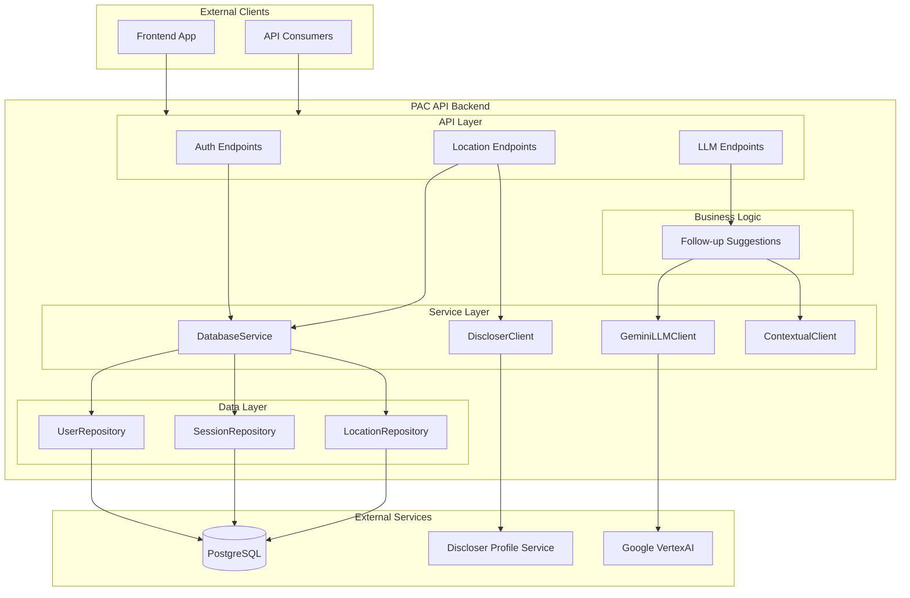
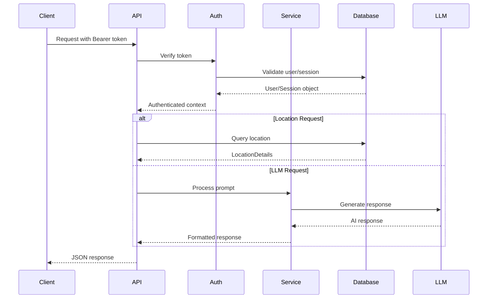

# PAC API Backend Documentation

Technical documentation for the PAC API backend application.

## Overview

## Documentation Index

| Document | Description |
|----------|-------------|
| [Authentication](./authentication.md) | User registration, login, session management, JWT tokens |
| [Database](./database.md) | SQLModel entities, repositories, connection pooling |
| [LLM Integration](./llm-integration.md) | Gemini API, follow-up suggestions, contextual responses |
| [Location Service](./location-service.md) | Location data retrieval, environmental statistics |
| [Discloser Service Client](./discloser-service.md) | External discloser profile geometry lookup by organization ID |
| [Security](./security.md) | Input sanitization, rate limiting, password policies |

## Quick Reference

### API Endpoints

| Endpoint | Method | Auth | Description |
|----------|--------|------|-------------|
| `/api/v1/health` | GET | - | Health check |
| `/api/v1/auth/register` | POST | - | User registration |
| `/api/v1/auth/login` | POST | - | User login |
| `/api/v1/auth/session` | POST | User | Create chat session |
| `/api/v1/auth/sessions` | GET | User | List user sessions |
| `/api/v1/auth/session/{id}/name` | PATCH | Session | Rename session |
| `/api/v1/auth/session/{id}` | DELETE | Session | Delete session |
| `/api/v1/location/{name}` | GET | - | Get location details |
| `/api/v1/chatbot/chat` | POST | Session | Chat endpoint |
| `/api/v1/suggest-follow-ups/suggest-follow-ups` | POST | Session | Generate follow-ups |

### Key Source Files

| Path | Description |
|------|-------------|
| `app/api/v1/auth.py` | Authentication endpoints |
| `app/api/v1/location.py` | Location endpoints |
| `app/api/v1/suggest_follow_ups.py` | LLM suggestion endpoints |
| `app/services/clients/database/base.py` | Database service |
| `app/services/impls/gemini_client.py` | Gemini LLM client |
| `app/services/interfaces/discloser_client.py` | Discloser client contract |
| `app/services/impls/discloser_client_impl.py` | Discloser profile geometry client implementation |
| `app/models/user.py` | User model |
| `app/models/session.py` | Session model |
| `app/models/location_details.py` | Location model |
| `app/utils/auth.py` | JWT utilities |
| `app/utils/sanitization.py` | Input sanitization |
| `app/shared/config.py` | Configuration |

### Data Flow

### Environment Configuration

| Category | Variables |
|----------|-----------|
| **Database** | `POSTGRES_HOST`, `POSTGRES_PORT`, `POSTGRES_DB`, `POSTGRES_USER`, `POSTGRES_PASSWORD` |
| **JWT** | `JWT_SECRET_KEY`, `JWT_ALGORITHM`, `JWT_ACCESS_TOKEN_EXPIRE_DAYS` |
| **LLM** | `PROJECT_ID`, `LOCATION`, `LLM_MODEL`, `LLM_TEMPERATURE` |
| **External Services** | `DISCLOSER_SERVICE_BASE_URL` |
| **Rate Limiting** | `RATE_LIMIT_DEFAULT`, endpoint-specific limits |
| **CORS** | `ALLOWED_ORIGINS` |

## Architecture Principles

1. **Layered Architecture** - Clear separation between API, service, and data layers
2. **Repository Pattern** - Database access abstracted through repositories
3. **Dependency Injection** - FastAPI's `Depends()` for loose coupling
4. **Singleton Services** - Shared instances for database and LLM clients
5. **Interface Contracts** - Protocol classes for service abstractions
