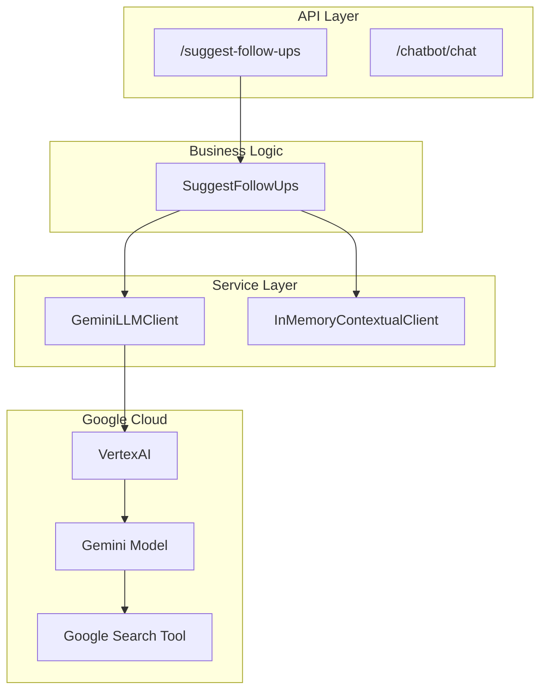
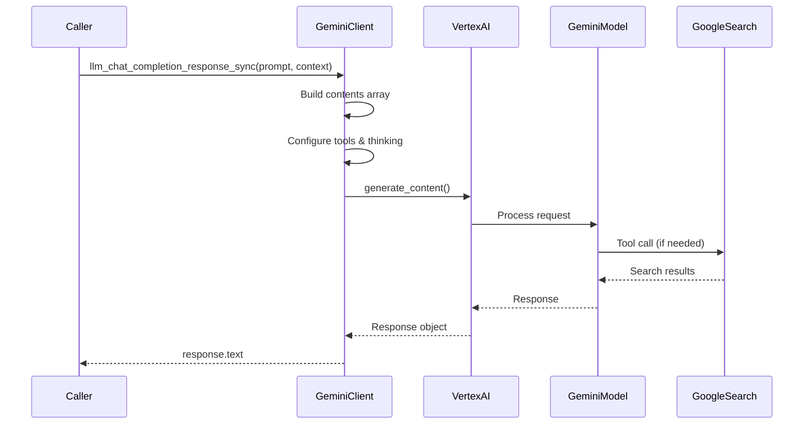
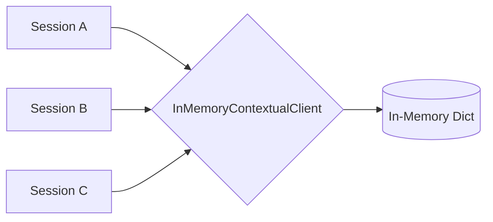
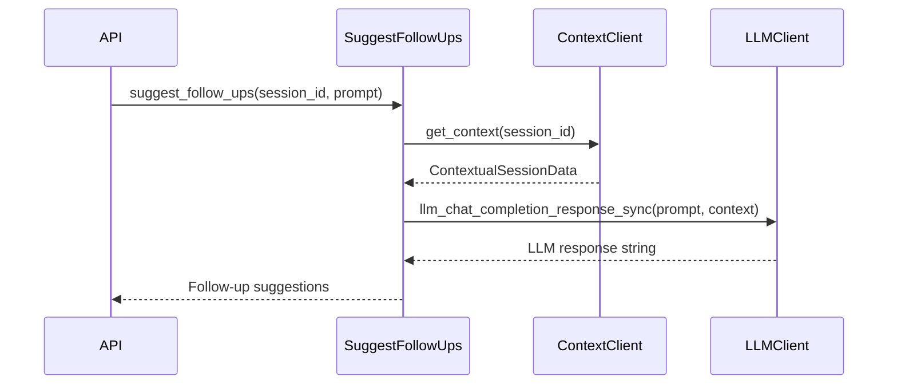

# LLM Integration

The backend integrates with Google's Gemini LLM via VertexAI for AI-powered features including follow-up suggestions and contextual responses.

## Architecture



## GeminiLLMClient

**Source:** `app/services/clients/gemini_client.py:7-82`

The `GeminiLLMClient` provides a lazy-initialized interface to Google's Gemini API via VertexAI.

### Client Initialization

```python
# app/services/clients/gemini_client.py:11-19
@property
def client(self):
    if self._client is None:
        self._client = genai.Client(
            vertexai=True,
            project=os.getenv("PROJECT_ID"),
            location=os.getenv("LOCATION"),
        )
    return self._client
```

**Required Environment Variables:**
| Variable | Description |
|----------|-------------|
| `PROJECT_ID` | Google Cloud project ID |
| `LOCATION` | GCP region (e.g., `us-central1`) |
| `LLM_MODEL` | Model name (default: `gemini-3-flash-preview`) |

### llm_chat_completion_response_sync()

**Source:** `app/services/clients/gemini_client.py:21-79`



**Parameters:**
| Parameter | Type | Description |
|-----------|------|-------------|
| `prompt` | `str` | User prompt to send to the LLM |
| `context` | `str` | System context for the conversation |
| `model` | `str | None` | Model override (defaults to env `LLM_MODEL`) |

**Configuration:**
```python
# app/services/clients/gemini_client.py:61-68
generate_content_config = types.GenerateContentConfig(
    thinking_config=types.ThinkingConfig(
        thinking_level=types.ThinkingLevel.HIGH,
    ),
    tools=tools,
)
```

**Features:**
- **Thinking Mode:** `HIGH` level for complex reasoning
- **Google Search Tool:** Integrated for real-time information retrieval
- **VertexAI Backend:** Enterprise-grade API access

### Message Structure

```python
# app/services/clients/gemini_client.py:41-54
contents = [
    types.Content(
        role="user",
        parts=[types.Part.from_text(text=prompt)],
    ),
    types.Content(
        role="system",
        parts=[types.Part.from_text(text=context)],
    ),
]
```

## InMemoryContextualClient

**Source:** `app/services/clients/contextual_client.py`

Manages session context for multi-turn conversations.



**Methods:**
| Method | Description |
|--------|-------------|
| `set_context(session_id, context)` | Store context for a session |
| `get_context(session_id)` | Retrieve context for a session |

## SuggestFollowUps

**Source:** `app/core/suggest_follow_ups.py:6-25`

Business logic for generating LLM-powered follow-up suggestions.

### Class Definition

```python
# app/core/suggest_follow_ups.py:6-9
class SuggestFollowUps:
    def __init__(self, llm_client: LLMClient, contextual_client: ContextualClient):
        self.contextual_client = contextual_client
        self.llm_client = llm_client
```

### suggest_follow_ups()

**Source:** `app/core/suggest_follow_ups.py:11-25`



**Flow:**
1. Retrieve session context from `InMemoryContextualClient`
2. Call `GeminiLLMClient.llm_chat_completion_response_sync()` with prompt and context
3. Return raw LLM response

## API Endpoint

**Source:** `app/api/v1/suggest_follow_ups.py:23-68`

### POST /suggest-follow-ups

```python
# app/api/v1/suggest_follow_ups.py:23-32
@router.post("/suggest-follow-ups", response_model=SuggestFollowUpsResponse)
@limiter.limit(settings.RATE_LIMIT_ENDPOINTS["suggest_follow_ups"][0])
async def suggest_follow_ups(
    request: Request,
    suggest_follow_ups_request: SuggestFollowUpsRequest,
    session: Session = Depends(get_current_session),
    llm_client: GeminiLLMClient = Depends(get_llm_client),
    contextual_client: InMemoryContextualClient = Depends(get_contextual_client),
) -> SuggestFollowUpsResponse:
```

**Request Schema:**
```python
class SuggestFollowUpsRequest(BaseModel):
    prompt: str
```

**Response Schema:**
```python
class SuggestFollowUpsResponse(BaseModel):
    response: str
```

**Authentication:** Requires valid session Bearer token

**Rate Limit:** Configured in `settings.RATE_LIMIT_ENDPOINTS["suggest_follow_ups"]`

## Dependency Injection

**Source:** `app/api/v1/deps.py`

```python
def get_llm_client() -> GeminiLLMClient:
    return gemini_service  # Singleton instance

def get_contextual_client() -> InMemoryContextualClient:
    return contextual_client  # Singleton instance
```

## Interface Contracts

### LLMClient Interface

**Source:** `app/services/interfaces/llm_client.py`

```python
class LLMClient(Protocol):
    def llm_chat_completion_response_sync(self, prompt: str, context: str) -> str:
        ...
```

### ContextualClient Interface

**Source:** `app/services/interfaces/contextual_client.py`

```python
class ContextualClient(Protocol):
    def get_context(self, session_id: str) -> ContextualSessionData:
        ...

    def set_context(self, session_id: str, context: ContextualSessionData) -> None:
        ...
```

## Configuration

| Variable | Default | Description |
|----------|---------|-------------|
| `PROJECT_ID` | - | Google Cloud project |
| `LOCATION` | - | GCP region |
| `LLM_MODEL` | `gemini-3-flash-preview` | Gemini model name |
| `LLM_TEMPERATURE` | 0.2 | Response randomness |
| `LLM_MAX_TOKENS` | 2000 | Max response tokens |
| `LLM_RETRIES` | 3 | Retry attempts |

**Source:** `app/shared/config.py`
