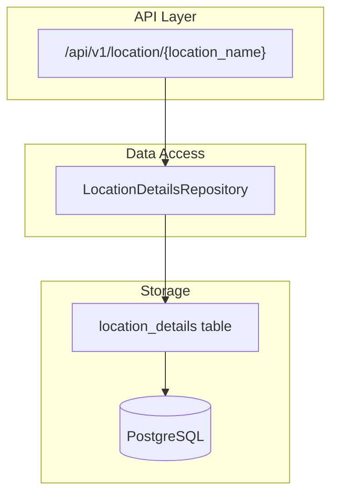
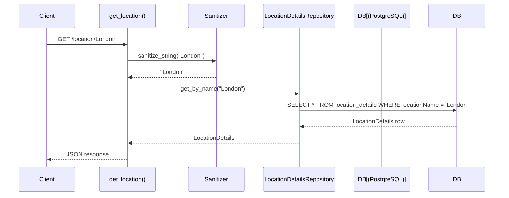
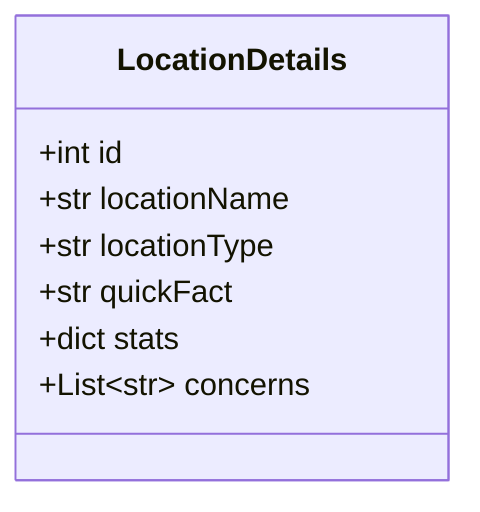
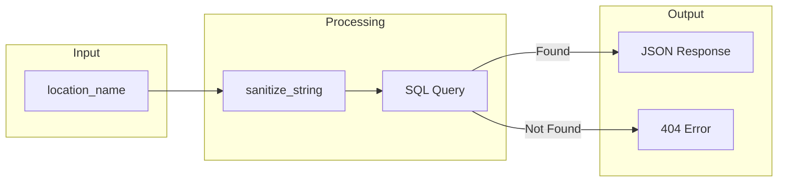

# Location Service

The location service provides access to climate and environmental data for geographic locations.

## Architecture



## API Endpoint

### GET /location/{location_name}

**Source:** `app/api/v1/location.py:17-39`

Retrieves location details by name from the database.

```python
# app/api/v1/location.py:17-39
@router.get("/location/{location_name}", response_model=LocationDetails)
async def get_location(
    location_name: str,
    repo: LocationDetailsRepository = Depends(get_location_details_repository),
):
```

**Request Flow:**



**Parameters:**
| Parameter | Type | Description |
|-----------|------|-------------|
| `location_name` | `str` | Name of the location to retrieve |

**Responses:**
| Status | Description |
|--------|-------------|
| 200 | Location details returned successfully |
| 404 | Location not found |

## Data Model

### LocationDetails

**Source:** `app/models/location_details.py:10-32`



**Table:** `location_details`

| Column | Type | Description |
|--------|------|-------------|
| `id` | `INTEGER` | Primary key |
| `locationName` | `VARCHAR` | Human-readable location name |
| `locationType` | `VARCHAR` | Classification (city, region, country) |
| `quickFact` | `TEXT` | Notable fact about the location |
| `stats` | `JSON` | Structured statistics |
| `concerns` | `JSON` | List of environmental concerns |

### Example Data

```json
{
  "id": 1,
  "locationName": "London",
  "locationType": "city",
  "quickFact": "London is the capital of England and the United Kingdom.",
  "stats": {
    "population": {
      "value": 8982000,
      "context": "As of 2021 census"
    },
    "area_km2": {
      "value": 1572,
      "context": "Greater London area"
    },
    "avg_temperature_c": {
      "value": 11.3,
      "context": "Annual average"
    }
  },
  "concerns": [
    "Air quality in central zones",
    "Urban heat island effect",
    "Flood risk from Thames"
  ]
}
```

## Response Schema

**Source:** `app/schemas/location.py`

### LocationStats

```python
class LocationStats(BaseModel):
    value: Union[int, float, str]
    context: str
```

### LocationDetails Schema

```python
class LocationDetails(BaseModel):
    locationName: str
    locationType: str
    quickFact: str
    stats: Dict[str, LocationStats]
    concerns: List[str]
```

## Repository

### LocationDetailsRepository

**Source:** `app/services/clients/database/location_details_repository.py`

```python
class LocationDetailsRepository:
    def __init__(self, engine: Engine):
        self.engine = engine

    def get_by_name(self, location_name: str) -> Optional[LocationDetails]:
        with Session(self.engine) as session:
            statement = select(LocationDetails).where(
                LocationDetails.locationName == location_name
            )
            return session.exec(statement).first()
```

**Methods:**
| Method | Description |
|--------|-------------|
| `get_by_name(location_name)` | Query location by exact name match |

## Input Sanitization

**Source:** `app/api/v1/location.py:36`

```python
location = repo.get_by_name(sanitize_string(location_name))
```

The `sanitize_string()` function (`app/utils/sanitization.py:12-34`) applies:
- HTML escaping to prevent XSS
- Script tag removal
- Null byte removal

## Dependency Injection

**Source:** `app/api/v1/deps.py`

```python
def get_location_details_repository() -> LocationDetailsRepository:
    return database_service.location_details
```

## Data Flow



## Error Handling

```python
# app/api/v1/location.py:37-38
if not location:
    raise HTTPException(status_code=404, detail="Location not found")
```

| Error | Status | Response |
|-------|--------|----------|
| Location not in database | 404 | `{"detail": "Location not found"}` |
