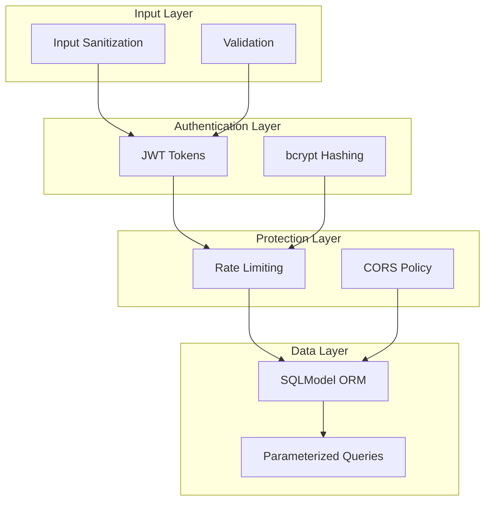
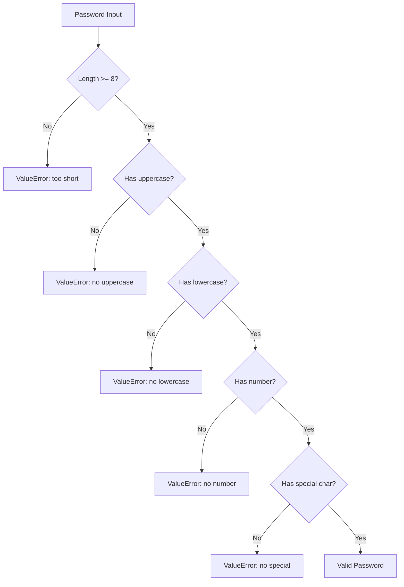
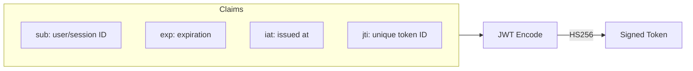
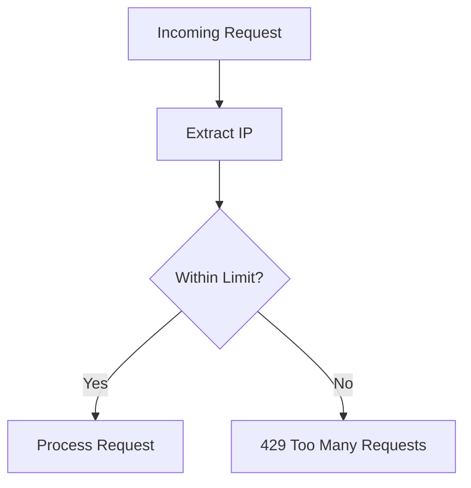

# Security

The backend implements multiple security layers to protect against common vulnerabilities.

## Security Architecture



## Input Sanitization

**Source:** `app/utils/sanitization.py`

### sanitize_string()

**Source:** `app/utils/sanitization.py:12-34`

```python
def sanitize_string(value: str) -> str:
    # HTML escape to prevent XSS
    value = html.escape(value)
    # Remove any script tags that might have been escaped
    value = re.sub(r"&lt;script.*?&gt;.*?&lt;/script&gt;", "", value, flags=re.DOTALL)
    # Remove null bytes
    value = value.replace("\0", "")
    return value
```

**Protections:**
| Attack | Mitigation |
|--------|------------|
| XSS | HTML entity escaping |
| Script injection | Script tag removal |
| Null byte injection | Null byte removal |

### sanitize_email()

**Source:** `app/utils/sanitization.py:37-53`

```python
def sanitize_email(email: str) -> str:
    email = sanitize_string(email)
    if not re.match(r"^[a-zA-Z0-9._%+-]+@[a-zA-Z0-9.-]+\.[a-zA-Z]{2,}$", email):
        raise ValueError("Invalid email format")
    return email.lower()
```

**Validations:**
- String sanitization applied
- Email format regex validation
- Lowercase normalization

### Recursive Sanitization

**Source:** `app/utils/sanitization.py:56-97`

```python
# For dictionaries
def sanitize_dict(data: Dict[str, Any]) -> Dict[str, Any]:

# For lists
def sanitize_list(data: List[Any]) -> List[Any]:
```

Recursively sanitizes nested data structures.

## Password Security

### Strength Validation

**Source:** `app/utils/sanitization.py:100-127`



**Requirements:**
| Requirement | Regex Pattern |
|-------------|---------------|
| Min 8 characters | `len(password) >= 8` |
| Uppercase letter | `[A-Z]` |
| Lowercase letter | `[a-z]` |
| Number | `[0-9]` |
| Special character | `[!@#$%^&*(),.?":{}|<>]` |

### bcrypt Hashing

**Source:** `app/models/user.py:42-46`

```python
@staticmethod
def hash_password(password: str) -> str:
    salt = bcrypt.gensalt()
    return bcrypt.hashpw(password.encode("utf-8"), salt).decode("utf-8")
```

- Uses bcrypt with automatic salt generation
- Password stored as UTF-8 encoded hash

## JWT Token Security

**Source:** `app/utils/auth.py`

### Token Structure



### Token Claims

## Rate Limiting

**Source:** `app/shared/limiter.py`



### Configuration

| Scope | Limit |
|-------|-------|
| Default | 200/day, 50/hour |
| Per-endpoint | Configurable via `RATE_LIMIT_ENDPOINTS` |

### Protected Endpoints

| Endpoint | Setting Key |
|----------|-------------|
| `/auth/register` | `register` |
| `/auth/login` | `login` |
| `/suggest-follow-ups` | `suggest_follow_ups` |

## SQL Injection Prevention

**Source:** All repository files

```python
# Using SQLModel's parameterized queries
statement = select(User).where(User.email == email)
user = session.exec(statement).first()
```

SQLModel/SQLAlchemy automatically parameterizes queries, preventing SQL injection.

## CORS Configuration

**Source:** `app/shared/config.py`

```python
ALLOWED_ORIGINS: str = Field(default="*")
```

Configure `ALLOWED_ORIGINS` environment variable for production.

## Security Headers

The FastAPI application can be configured with security headers via middleware:

```python
# Example security headers
{
    "X-Content-Type-Options": "nosniff",
    "X-Frame-Options": "DENY",
    "X-XSS-Protection": "1; mode=block",
    "Strict-Transport-Security": "max-age=31536000; includeSubDomains"
}
```

## Message Content Validation

**Source:** `app/schemas/chat.py`

Chat messages are validated for:
- Length limits (1-3000 characters)
- Script tag blocking
- Null byte removal

## Security Checklist

| Category | Implementation |
|----------|----------------|
| **Authentication** | |
| Password hashing | bcrypt with salt |
| Token-based auth | JWT with HS256 |
| Token expiration | 30 days default |
| Unique token IDs | `jti` claim |
| **Input Validation** | |
| XSS prevention | HTML escaping |
| Script injection | Tag removal |
| SQL injection | Parameterized queries |
| Email validation | Regex pattern |
| **Access Control** | |
| Rate limiting | slowapi |
| CORS | Configurable origins |
| Session isolation | User-specific sessions |
| **Data Protection** | |
| Secure storage | PostgreSQL |
| Minimal exposure | ORM abstraction |

## Environment Variables

| Variable | Purpose |
|----------|---------|
| `JWT_SECRET_KEY` | Token signing key |
| `JWT_ALGORITHM` | Signing algorithm (HS256) |
| `JWT_ACCESS_TOKEN_EXPIRE_DAYS` | Token lifetime |
| `ALLOWED_ORIGINS` | CORS allowed origins |
| `RATE_LIMIT_DEFAULT` | Default rate limit |
