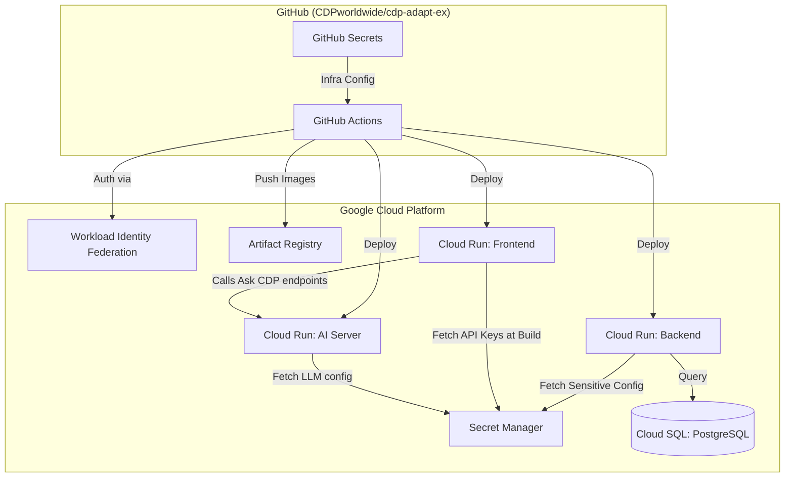
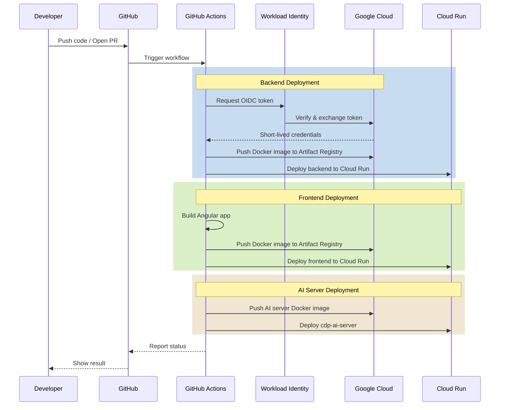

# Deployment & CI/CD Guide

This document provides a comprehensive overview of the deployment architecture, environment configuration, and CI/CD pipelines.

---

## 🏗 Part 1: Deployment & Infrastructure

The platform uses a fully serverless architecture on **Google Cloud Platform (GCP)**.

### Architecture Overview

The frontend (Angular), backend (FastAPI), and AI server are containerized and deployed to **Cloud Run**.



### 🌍 Environments & Branching

We maintain separate environments for development, staging (previews), and production.

| Workflow / Branch | Environment | Backend Service | Frontend Service | AI Service | Cloud SQL Instance | Secret Prefix |
|--------|-------------|-----------------|------------------|------------|-------------------|---------------|
| `deploy.yml` on `production` | `production` | `cdp-server-prod` | `frontend` | `cdp-ai-server` | `cdp-prod` | `production-` |
| Frontend PR previews | `development` / preview | shared `cdp-server-dev` | `frontend-preview-pr-X` | shared `cdp-ai-server` | `cdp-test` | `development-` |
| Backend PR previews | `development` / preview | `cdp-server-preview-pr-X` | n/a | shared `cdp-ai-server` | `cdp-test` | `development-` |
| Manual backend workflow on `main` | `development` | `cdp-server-dev` | n/a | shared `cdp-ai-server` | `cdp-test` | `development-` |

### 🛠 One-Time Infrastructure Setup

Before the first deployment, the following GCP infrastructure must be configured.

#### 1. Enable APIs
```bash
gcloud services enable \
  run.googleapis.com \
  artifactregistry.googleapis.com \
  secretmanager.googleapis.com \
  sqladmin.googleapis.com \
  iam.googleapis.com
```

#### 2. Create Artifact Registry
```bash
gcloud artifacts repositories create cdp \
  --repository-format=docker \
  --location=us-central1 \
  --description="CDP Docker images"
```

### 🔑 Configuration & Secrets

Secrets are split between GitHub (for CI/CD infrastructure) and GCP Secret Manager (for application runtime).

#### GCP Secret Manager
Sensitive variables must be defined in Secret Manager with the appropriate environment prefix, except shared services such as `cdp-ai-server`, which use a `shared-` prefix. These are accessed by the application at runtime (Backend/AI server) or during the build process (Frontend).

| Secret Name | Description |
|-------------|-------------|
| `POSTGRES_PASSWORD` | Database user password. |
| `POSTGRES_HOST` | Database host (e.g., Cloud SQL Unix socket path). |
| `POSTGRES_DB` | Database name (e.g., `cdp`). |
| `POSTGRES_USER` | Database username. |
| `API_KEY` | Shared API key required by protected backend endpoints. |
| `LLM_API_KEY` | API Key for Vertex AI / Gemini. |
| `shared-AI_SERVER_API_KEY` | Shared key for the `cdp-ai-server` Cloud Run service and frontend builds that call it directly. |
| `ALLOWED_ORIGINS` | CORS origins (comma-separated). |
| `GOOGLE_MAPS_API_KEY` | Google Maps API Key. |

Optional frontend analytics and error reporting are configured through GitHub Actions variables:

| Variable Name | Description |
|---------------|-------------|
| `FRONTEND_POSTHOG_KEY` | PostHog project key compiled into the frontend when analytics should be enabled. |
| `FRONTEND_POSTHOG_HOST` | PostHog ingestion host. Defaults to the first-party `/_cdp` reverse proxy path when unset. |
| `FRONTEND_POSTHOG_UI_HOST` | PostHog app host used for toolbar and dashboard links when ingestion is proxied. Defaults to `https://eu.posthog.com`. |
| `FRONTEND_POSTHOG_ENABLED` | Set to `true` to enable PostHog during frontend builds. Defaults to `false` when unset. |
| `FRONTEND_SENTRY_DSN` | Sentry frontend DSN compiled into the frontend when browser exception reporting should be enabled. |
| `FRONTEND_SENTRY_ENABLED` | Set to `true` to enable Sentry during frontend builds. Defaults to `false` when unset. |
| `FRONTEND_SENTRY_TRACES_SAMPLE_RATE` | Sentry performance tracing sample rate. Defaults to `0.05` when unset. |

Frontend builds set the Sentry release to the GitHub commit SHA and the Sentry environment to the workflow environment.

Slack notifications for large or recurring frontend errors should be configured in Sentry, not through a frontend webhook. Connect the Sentry Slack integration and add alert rules for production frontend issues, regressions, and error volume thresholds such as `10 events in 10 minutes`.

### 📈 Monitoring & Logs

#### View Deployment Logs
```bash
# List revisions for a service
gcloud run revisions list --service [SERVICE_NAME] --region us-central1

# View logs for the latest revision
gcloud run services describe [SERVICE_NAME] --region us-central1 --format="value(status.latestReadyRevisionName)" | \
  xargs -I {} gcloud logging read "resource.labels.revision_name={}" --limit 50
```

#### Performance Metrics
Monitoring can be found in the [Cloud Run Console](https://console.cloud.google.com/run) under each service:
- **Metrics Tab**: Request count, latency, memory/CPU utilization.
- **Log Health**: Set up Cloud Monitoring alerts for error rate thresholds.

---

## 🚀 Part 2: CI/CD Pipelines

Our automation is handled via GitHub Actions, following a modular "Orchestrator" pattern.

### 🔑 GitHub-GCP Authentication (WIF)

Before the pipelines can run, you must establish a secure connection between GitHub and Google Cloud using **Workload Identity Federation (WIF)**. This eliminates the need for long-lived service account keys.

- **Workload Identity Pool**: `github-actions`
- **Provider**: `github`
- **Setup Link**: [Follow the official Google guide for WIF setup](https://github.com/google-github-actions/auth#direct-wif).

### 🔑 Required GitHub Secrets

The following repository secrets must be configured in GitHub (**Settings > Secrets and variables > Actions**) for the pipelines to function:

| Secret Name | Description |
|-------------|-------------|
| `GCP_PROJECT_ID` | Your Google Cloud Project ID. |
| `GCP_WORKLOAD_IDENTITY_PROVIDER` | The full resource name of the WIF provider (e.g., `projects/123/locations/global/workloadIdentityPools/github-actions/providers/github`). |
| `BASE_URL` | (Optional) The production URL of the backend, used if auto-detection fails. |

### Pipeline Flow



### 1. Production (`deploy.yml`)
Triggered on **push** to the `production` branch or by manual dispatch.
- **Orchestration**: Deploys the backend first, verifies health via `/api/v1/health`, then builds the frontend with the backend `baseUrl`, AI server URL, API keys, Google Maps key, and optional PostHog analytics and Sentry error reporting settings injected at compile time.
- **Verification**: Automatically rolls back if the backend health check fails.

### 2. PR Previews (`backend-deploy.yml` & `frontend-preview.yml`)
Triggered on **pull request** updates.
- **Frontend previews**: Each frontend PR gets a unique frontend service name (`frontend-preview-pr-{NUMBER}`) and builds against the shared `cdp-server-dev` backend deployed from `main`.
- **Backend previews**: Backend PRs get a unique backend service name (`cdp-server-preview-pr-{NUMBER}`) when backend code or backend deployment workflow files change.
- **Database**: Uses the `development` database and secrets.
- **Cleanup**: Previews are automatically deleted when PRs are closed.

### 3. AI Server (`ai-server-deploy.yml`)
Triggered on pushes to `main` or `production` that touch `ai-server/**`, excluding prompt-only edits to `app/prompts/system_prompt.md`.
- **Runtime**: Deploys the shared `cdp-ai-server` Cloud Run service.
- **Prompt source**: The deployed service reads `SYSTEM_PROMPT` from a stable Gist URL and refreshes it after `SYSTEM_PROMPT_CACHE_SECONDS`.
- **Frontend contract**: The Angular app calls `/v1/chat/completions` and `/v1/suggest-follow-ups` on this service directly.

---

## 🔍 Troubleshooting

### "Env var type" deployment error
If switching from a Secret Manager reference to a plain string (or vice-versa), Cloud Run may fail to update.
**Fix**: Delete the service and redeploy:
```bash
gcloud run services delete [SERVICE_NAME] --region us-central1
```

### Permission Denied (WIF)
Ensure the repository path in the IAM binding matches exactly: `CDPworldwide/cdp-adapt-ex`.

### Frontend connecting to wrong backend
The frontend build injects the backend URL at compile time. Ensure the `deploy-backend` job in `deploy.yml` finishes successfully and outputs the correct URL to the `deploy-frontend` job.
