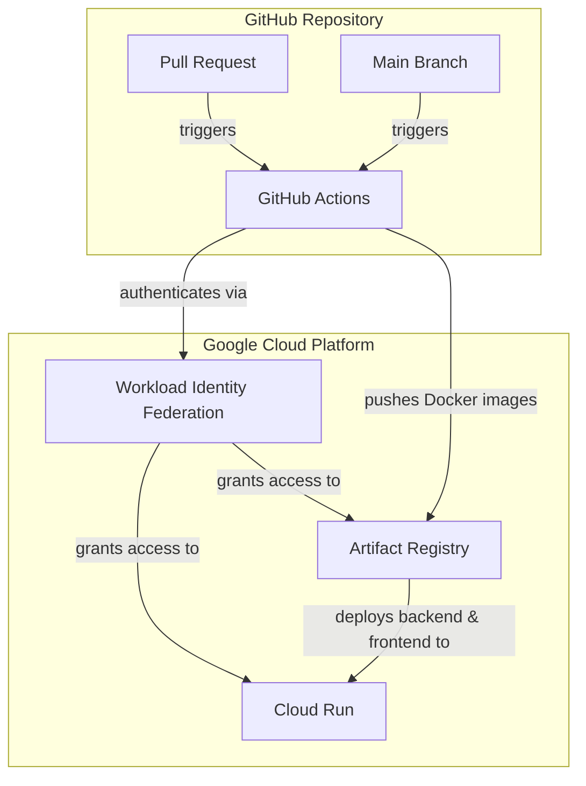
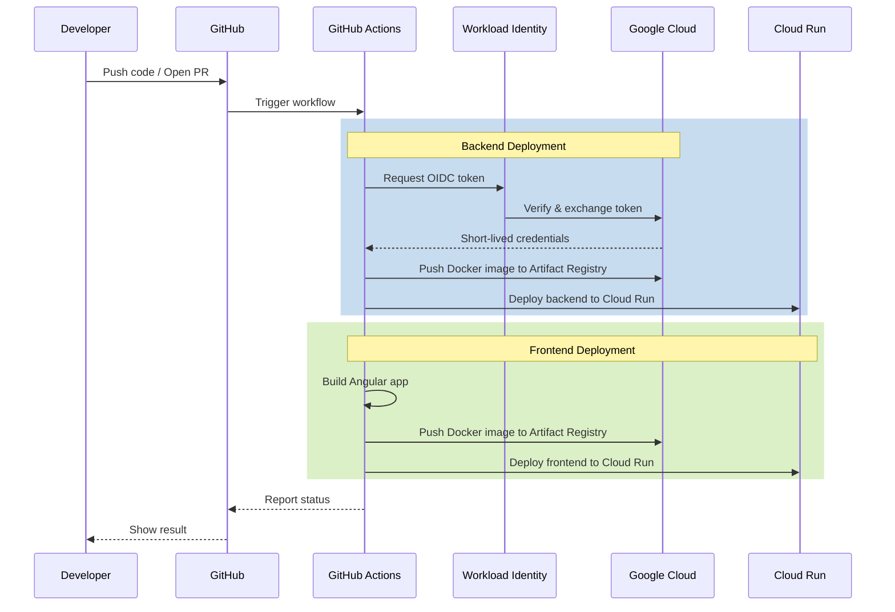
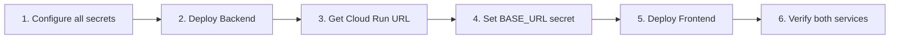
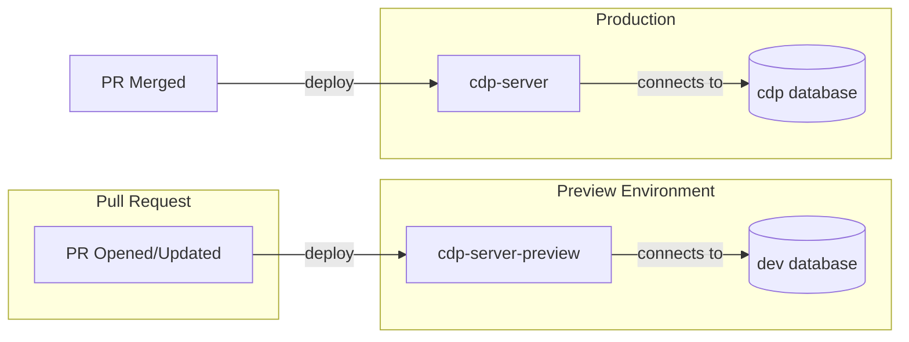

# CI/CD Deployment Setup Guide

Automatic deployments to Cloud Run for both frontend and backend based on the target branch.

> **Regular deployments:**
> - Push to `main` to deploy to the **Development** environment.
> - Push to `production` to deploy to the **Production** environment.

## Overview

| Branch | Environment | Backend Service | Frontend Service | Secret Prefix |
|--------|-------------|-----------------|------------------|---------------|
| `main` | `development` | `cdp-server-dev` | `frontend-dev` | `development-` |
| `production` | `production` | `cdp-server-prod` | `frontend-prod` | `production-` |
| `PR Previews` | `development` | `cdp-server-preview-pr-X` | `frontend-preview-pr-X` | `development-` |

All workflows can be triggered manually via `workflow_dispatch`.

### PR Preview Deployments

When a PR is opened against `main` or `production`, the workflow automatically deploys to a temporary preview environment:
- **Environment:** Uses `development` configuration and secrets.
- **Isolation:** Each PR gets its own isolated Cloud Run services.
- **Cleanup:** Preview services are automatically deleted when the PR is closed.

A comment is added to the PR with the preview URL.

## Secret Management

We use **GCP Secret Manager** as the single source of truth for sensitive environment configuration.

### Secret Naming Convention
Secrets must be prefixed with the environment name:
- `development-<SECRET_NAME>`
- `production-<SECRET_NAME>`

### Required Secrets in GCP
The following secrets must be defined in GCP Secret Manager for **both** prefixes:

| Secret Name | Description |
|-------------|-------------|
| `POSTGRES_PASSWORD` | Password for the Cloud SQL user |
| `POSTGRES_HOST` | Unix Socket Path for Cloud Run: `/cloudsql/PROJECT_ID:REGION:INSTANCE_NAME` |
| `POSTGRES_DB` | Name of the PostgreSQL database |
| `POSTGRES_USER` | Username for the PostgreSQL database |
| `LLM_API_KEY` | Google VertexAI / Gemini API Key |
| `ALLOWED_ORIGINS` | CORS allowed origins (comma-separated) |
| `FIREBASE_API_KEY` | Frontend Firebase API Key |
| `FIREBASE_AUTH_DOMAIN` | Frontend Firebase Auth Domain |
| `FIREBASE_PROJECT_ID` | Frontend Firebase Project ID |
| `GOOGLE_MAPS_API_KEY` | Frontend Google Maps API Key |

### Cloud SQL Instances
The environments are hardcoded to point to separate Cloud SQL instances:
- **Development:** `cdp-dev`
- **Production:** `cdp-prod`

## Architecture Overview



## CI/CD Pipeline Flow



## Quick Links

- **GitHub Secrets:** https://github.com/CDPworldwide/pac-api/settings/secrets/actions
- **Cloud Run Console:** https://console.cloud.google.com/run
- **Artifact Registry:** https://console.cloud.google.com/artifacts

## First Deployment Order



1. Complete [Backend Deployment Setup](./backend.md) first
2. Get the Cloud Run URL after deployment
3. Set `BASE_URL` GitHub secret with the Cloud Run URL
4. Complete [Frontend Deployment Setup](./frontend.md)

## Troubleshooting

### "Permission denied" on Workload Identity

Ensure the repository name in the IAM binding matches exactly (case-sensitive):
```bash
gcloud iam service-accounts get-iam-policy github-actions-deployer@PROJECT_ID.iam.gserviceaccount.com
```

### Tests fail in CI but pass locally

Check environment variables - CI may be missing secrets or have different values.

### Updating Secrets

**Google Cloud Secret Manager:**
```bash
echo -n "NEW_VALUE" | gcloud secrets versions add SECRET_NAME --data-file=-
```

**GitHub Secrets:**
1. Go to Settings → Secrets and variables → Actions
2. Click on the secret
3. Click "Update" and paste the new value

---

## PR Preview Deployments

The `backend-deploy.yml` workflow handles both production and preview deployments:



### How It Works

| Event | Service | Database | APP_ENV |
|-------|---------|----------|---------|
| PR opened/updated | `cdp-server-preview` | `dev` | `staging` |
| PR merged to main | `cdp-server` | `cdp` | `production` |

When a PR is opened, the workflow:
1. Runs tests
2. Deploys to `cdp-server-preview`
3. Comments on the PR with the preview URL

When the PR is merged, the workflow:
1. Runs tests
2. Deploys to production `cdp-server`
