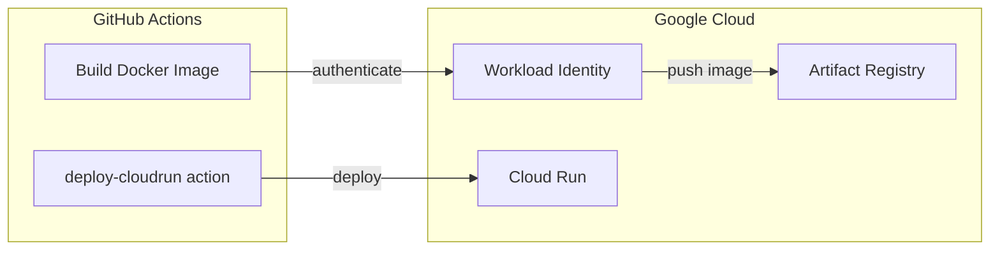
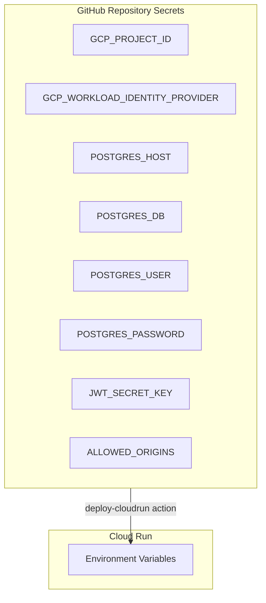

# Backend Deployment (Cloud Run)

This guide covers deploying the backend Python API to Google Cloud Run.

> **For day-to-day deployments:** See [Step 4: Deploy](#step-4-deploy) - the workflow automatically deploys when you push to main.
>
> **First-time setup only:** Steps 1-3 are one-time infrastructure setup. Skip if already configured.

## Overview



> **Note:** This workflow uses **GCP Secret Manager** for all sensitive configuration values (passwords, API keys). Non-sensitive infrastructure settings (Project ID, Regions) are still managed via GitHub Secrets.

## Step 1: Google Cloud Setup

### 1.1 Enable Required APIs

```bash
gcloud services enable \
  run.googleapis.com \
  artifactregistry.googleapis.com \
  cloudbuild.googleapis.com \
  secretmanager.googleapis.com \
  iam.googleapis.com \
  iamcredentials.googleapis.com \
  sqladmin.googleapis.com
```

### 1.2 Create Artifact Registry Repository

```bash
gcloud artifacts repositories create cdp \
  --repository-format=docker \
  --location=us-central1 \
  --description="CDP Docker images"
```

### 1.3 Secret Manager Configuration

You must create secrets in GCP Secret Manager with the environment prefix (`development-` or `production-`).

```bash
# Example for development
printf "your-password" | gcloud secrets create development-POSTGRES_PASSWORD --data-file=-
```

### 1.4 Grant Required Roles

The workflow uses Workload Identity Federation. The following roles are required:

```bash
PROJECT_ID=$(gcloud config get-value project)
PROJECT_NUMBER=$(gcloud projects describe $PROJECT_ID --format="value(projectNumber)")
# If using a custom service account for Cloud Run (recommended)
SERVICE_ACCOUNT_EMAIL="your-service-account@${PROJECT_ID}.iam.gserviceaccount.com"

# Allow Cloud Run to access secrets
gcloud projects add-iam-policy-binding $PROJECT_ID \
  --member="serviceAccount:${SERVICE_ACCOUNT_EMAIL}" \
  --role="roles/secretmanager.secretAccessor"

# Allow GitHub Actions to manage Cloud Run
PRINCIPAL="principalSet://iam.googleapis.com/projects/${PROJECT_NUMBER}/locations/global/workloadIdentityPools/github-actions/attribute.repository/CDPworldwide/pac-api"
# ... existing role bindings ...
```

---

## Step 2: Workload Identity Federation Setup

Workload Identity Federation allows GitHub Actions to authenticate to Google Cloud without storing service account keys. This setup should already be configured for the CDPworldwide/pac-api repository.

**For detailed setup instructions**, see the official documentation:
- [Direct Workload Identity Federation Guide](https://github.com/google-github-actions/auth?tab=readme-ov-file#direct-wif)

**Key configuration for this project:**
- Workload Identity Pool: `github-actions`
- Provider: `github`
- Repository: `CDPworldwide/pac-api`

**To verify the setup**, get the Workload Identity Provider resource name:

```bash
PROJECT_NUMBER=$(gcloud projects describe $(gcloud config get-value project) --format="value(projectNumber)")
echo "projects/${PROJECT_NUMBER}/locations/global/workloadIdentityPools/github-actions/providers/github"
```

This value is needed for the `GCP_WORKLOAD_IDENTITY_PROVIDER` GitHub secret.

---

## Step 3: GitHub Secrets Configuration

Go to your GitHub repository → Settings → Secrets and variables → Actions → New repository secret

**Direct link:** https://github.com/CDPworldwide/pac-api/settings/secrets/actions

### Required Secrets

All secrets are stored in GitHub - no GCP Secret Manager required.



### GitHub Secrets Reference

| Secret Name | Value | How to Get |
|-------------|-------|------------|
| `GCP_PROJECT_ID` | Your GCP project ID | `gcloud config get-value project` |
| `GCP_WORKLOAD_IDENTITY_PROVIDER` | Full provider path | See Step 2.5 output. Format: `projects/PROJECT_NUMBER/locations/global/workloadIdentityPools/github-actions/providers/github` |
| `POSTGRES_HOST` | Database host | Cloud SQL instance IP or Neon connection string |
| `POSTGRES_DB` | Database name | e.g., `cdp` or `neondb` |
| `POSTGRES_USER` | Database username | e.g., `postgres` |
| `POSTGRES_PASSWORD` | Database password | Your production database password |
| `JWT_SECRET_KEY` | Secret for signing JWT tokens | Generate with: `openssl rand -hex 32` |
| `ALLOWED_ORIGINS` | CORS origins | Frontend URLs, comma-separated (e.g., `https://your-app.web.app,https://your-domain.com`) |

---

## Step 4: Deploy

### Option A: Push to main branch

Push a change to `backend/`:
```bash
git add backend/
git commit -m "Trigger backend deployment"
git push origin main
```

### Option B: Manual trigger

1. Go to GitHub → Actions → "Backend Deploy to Cloud Run"
2. Click "Run workflow"

### Get the deployed service URL

```bash
gcloud run services describe cdp-server --region=us-central1 --format="value(status.url)"
```

---

## Troubleshooting

### Docker push fails

Check Artifact Registry permissions:
```bash
gcloud artifacts repositories get-iam-policy cdp --location=us-central1
```

### Cloud Run deployment fails with "env var type" error

If you see an error like:
```
Cannot update environment variable [X] to string literal because it has already been set with a different type.
```

This happens when switching from GCP Secret Manager refs to plain env vars. Delete the service and redeploy:
```bash
gcloud run services delete cdp-server --region us-central1 --quiet
```
Then trigger the workflow again.

---

## Manual Rollback

```bash
# List revisions
gcloud run revisions list --service=cdp-server --region=us-central1

# Rollback to previous revision
gcloud run services update-traffic cdp-server \
  --region=us-central1 \
  --to-revisions=REVISION_NAME=100
```

---

## Manual Deployment (Without CI/CD)

If you need to deploy manually without using GitHub Actions:

1. Build and submit to Artifact Registry:
   ```bash
   cd backend
   gcloud builds submit --region=us-central1 \
     --tag us-central1-docker.pkg.dev/PROJECT_ID/cdp/server:latest
   ```

2. Verify the image in Artifact Registry (Cloud Console)

3. Deploy to Cloud Run:
   ```bash
   gcloud run deploy cdp-server \
     --image us-central1-docker.pkg.dev/PROJECT_ID/cdp/server:latest \
     --region us-central1 \
     --platform managed
   ```
