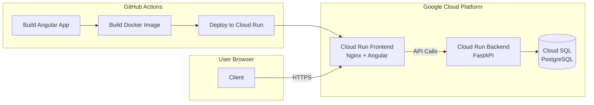

# Frontend Deployment (Cloud Run)

This guide covers deploying the frontend Angular app to Google Cloud Run.

> **For day-to-day deployments:** The workflow automatically deploys when you push to main. See [Step 2: Workflow Configuration](#step-2-workflow-configuration).
>
> **First-time setup only:** Step 1 is one-time secret configuration. Skip if already configured.

## Overview

**Current Architecture: Cloud Run Only (No Firebase Hosting)**

Both frontend and backend are deployed to Google Cloud Run. The frontend serves the Angular static files via Nginx.



## Architecture Details

**Frontend Stack:**
- **Platform:** Google Cloud Run (serverless containers)
- **Web Server:** Nginx (serves static Angular files)
- **Framework:** Angular 17+
- **Build Output:** Static files in `dist/frontend/browser`

**Why Cloud Run Instead of Firebase Hosting:**
- Unified platform (both frontend & backend on Cloud Run)
- Better integration with GCP services
- More control over server configuration
- Simpler CI/CD pipeline
- Cost-effective with auto-scaling to zero

**Flow:**
1. User requests frontend → Cloud Run (Nginx)
2. Nginx serves Angular SPA
3. Angular app makes API calls → Cloud Run Backend
4. Backend queries Cloud SQL database
5. Response flows back to user

---

## Prerequisites

- GCP Project with Cloud Run enabled
- Workload Identity Federation configured (see backend deployment guide)
- Backend deployed first (to get the `BASE_URL`)

---

## Step 1: Configuration

Frontend configuration is split between GitHub Secrets (for infrastructure) and GCP Secret Manager (for API keys).

### GitHub Secrets
These are used by the CI/CD pipeline itself to authenticate with Google Cloud.

| Secret Name | Description |
|-------------|-------------|
| `GCP_PROJECT_ID` | Your GCP project ID |
| `GCP_WORKLOAD_IDENTITY_PROVIDER` | Workload Identity Provider string |

### GCP Secret Manager
Sensitive keys are fetched from GCP during the Angular build process. They must be prefixed with `development-` or `production-`.

| Secret Name | Source |
|-------------|--------|
| `FIREBASE_API_KEY` | Firebase Console → Project Settings |
| `FIREBASE_AUTH_DOMAIN` | Firebase Console → Web App Config |
| `FIREBASE_PROJECT_ID` | Firebase Console → Project ID |
| `GOOGLE_MAPS_API_KEY` | GCP Console → Credentials |

**Note:** The `BASE_URL` (Backend API URL) is now automatically detected by the deployment orchestrator, so you do not need to set it manually.

---

## Step 2: Branch-Based Environments

The frontend targets different Cloud Run services based on the branch:

1.  **Main Branch**: Deploys to `frontend-dev`.
2.  **Production Branch**: Deploys to `frontend-prod`.
3.  **Pull Requests**: Deploys to `frontend-preview-pr-X` (isolated).

---

The frontend deployment workflow (`.github/workflows/frontend-deploy.yml`) handles:

### Preview Deployments (Pull Requests)
- **Trigger:** Pull requests to main
- **Service Name:** `frontend-preview-pr-{PR_NUMBER}` (isolated per PR)
- **Backend:** Connects to `cdp-server-preview-pr-{PR_NUMBER}`
- **Database:** Dev database (isolated from production)
- **Auto-cleanup:** Deletes service when PR closes
- **URL Format:** `https://frontend-preview-pr-{N}-{hash}.{region}.run.app`

### Production Deployments
- **Trigger:** Push to main branch
- **Service Name:** `frontend` (stable)
- **Backend:** Connects to `cdp-server` (production)
- **Database:** Production database
- **URL Format:** `https://frontend-{hash}.{region}.run.app`

### Draft PR Filter
Draft PRs are skipped to save costs. Mark PR as "Ready for review" to trigger deployment.

---

## Step 3: Deploy

### Option A: Push to main branch (Production)

Push a change to `frontend/`:
```bash
git add frontend/
git commit -m "Update frontend feature"
git push origin main
```

### Option B: Create Pull Request (Preview)

```bash
git checkout -b feature/my-feature
# Make changes
git add .
git commit -m "Add new feature"
git push origin feature/my-feature
# Create PR on GitHub
```

The workflow will:
1. Build the Angular app with environment config
2. Create Docker image with Nginx
3. Deploy to Cloud Run with unique PR-specific URL
4. Comment on PR with preview URL and test credentials

### Option C: Manual trigger

1. Go to GitHub → Actions → "Frontend Deploy to Cloud Run"
2. Click "Run workflow"

---

## Container Architecture

The frontend uses a multi-stage Docker build:

**Dockerfile:**
```dockerfile
FROM nginx:alpine
COPY dist/frontend/browser /usr/share/nginx/html
COPY nginx.conf /etc/nginx/conf.d/default.conf
EXPOSE 8080
CMD ["nginx", "-g", "daemon off;"]
```

**Nginx Configuration:**
- Serves Angular static files
- Handles SPA routing (all routes → index.html)
- Gzip compression enabled
- Security headers configured

---

## Troubleshooting

### Deployment fails with authentication error

1. Verify Workload Identity Federation is configured correctly
2. Check that the GitHub Actions service account has Cloud Run Admin role
3. See backend deployment guide for Workload Identity setup

### Build fails with environment errors

Check that all Firebase config secrets are set correctly in GitHub secrets.

### API calls fail (CORS errors)

Ensure `ALLOWED_ORIGINS` in backend includes your Cloud Run frontend URL:
- For preview: Set to `*` (automatic in preview environments)
- For production: Add specific frontend URL to `ALLOWED_ORIGINS`

### Frontend shows "Cannot connect to backend"

1. Check that `BASE_URL` points to correct backend
2. For previews: Verify backend preview exists for same PR number
3. Check backend health: `curl {BACKEND_URL}/api/v1/health`
4. Verify backend CORS allows frontend origin

### Google Maps not loading

1. Verify `GOOGLE_MAPS_API_KEY` is set
2. Check the API key has Maps JavaScript API enabled in Google Cloud Console
3. Check API key restrictions allow your Cloud Run domain

### Preview deployment uses production database

Check that the workflow correctly sets backend URL:
- Should be `cdp-server-preview-pr-{N}` for PR previews
- Check workflow logs for "Backend URL" output

---

## Cost Optimization

### Auto-scaling to Zero
Cloud Run scales to 0 instances when not in use:
- **Preview environments:** min-instances=0, max-instances=2
- **Production:** min-instances=0, max-instances=10

### Draft PR Filter
Draft PRs don't trigger deployments to save costs. Mark as "Ready for review" to deploy.

### Cleanup on PR Close
Preview services are automatically deleted when PR closes, preventing orphaned resources.

### Monitoring Costs
View Cloud Run costs in GCP Console:
1. Go to Billing → Reports
2. Filter by Service: Cloud Run
3. Group by: Service name or SKU

**Expected costs:**
- Preview environments: ~$0 (scales to zero)
- Production (low traffic): ~$5-10/month
- Artifact Registry storage: ~$0.10/GB/month

---

## Manual Deployment (Without CI/CD)

If you need to deploy manually:

1. **Build the frontend:**
   ```bash
   cd frontend
   npm ci
   npm run build
   ```

2. **Build Docker image:**
   ```bash
   docker build -t gcr.io/YOUR_PROJECT_ID/frontend:latest .
   docker push gcr.io/YOUR_PROJECT_ID/frontend:latest
   ```

3. **Deploy to Cloud Run:**
   ```bash
   gcloud run deploy frontend \
     --image gcr.io/YOUR_PROJECT_ID/frontend:latest \
     --region us-central1 \
     --allow-unauthenticated \
     --port 8080
   ```

---

## Environment Configuration

The workflow creates `src/environments/environment.ts` at build time with:

```typescript
export const environment = {
  production: true,
  baseUrl: '${BASE_URL}',  // Dynamic based on preview/production
  firebaseConfig: {
    apiKey: '${FIREBASE_API_KEY}',
    authDomain: '${FIREBASE_AUTH_DOMAIN}',
    projectId: '${FIREBASE_PROJECT_ID}',
    storageBucket: '${FIREBASE_STORAGE_BUCKET}',
    messagingSenderId: '${FIREBASE_MESSAGING_SENDER_ID}',
    appId: '${FIREBASE_APP_ID}',
    measurementId: '${FIREBASE_MEASUREMENT_ID}',
  },
  mapsConfig: {
    apiKey: '${GOOGLE_MAPS_API_KEY}',
  }
};
```

**For preview environments:**
- `baseUrl` dynamically fetched from Cloud Run backend service
- Waits up to 2 minutes for backend service to be ready
- Falls back to shared preview URL if backend not found

This ensures sensitive config is never committed to the repository.

---

## Monitoring & Logs

### View Deployment Logs
```bash
# List revisions
gcloud run revisions list --service frontend --region us-central1

# View logs for latest revision
gcloud run services describe frontend --region us-central1 --format="value(status.latestReadyRevisionName)" | \
  xargs -I {} gcloud logging read "resource.labels.revision_name={}" --limit 50
```

### Monitor Performance
1. Go to Cloud Run → Select service
2. View metrics: Request count, latency, error rate
3. Set up alerts for error rate thresholds

### Common Log Filters
```bash
# View all frontend logs
gcloud logging read "resource.type=cloud_run_revision AND resource.labels.service_name=frontend"

# View errors only
gcloud logging read "resource.type=cloud_run_revision AND resource.labels.service_name=frontend AND severity>=ERROR"
```
